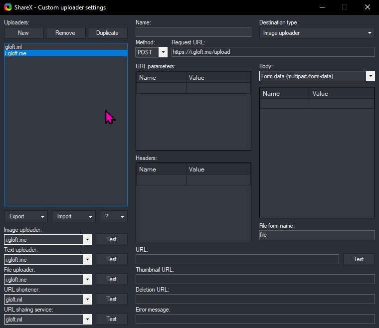

# i

i is a minimal program for uploading files to your server and getting a "i.example.com/file.png" link back, similar to imgur.com. It is compatible with the open source image capture program [Share X](https://getsharex.com/).

It does ***not*** serve the files or handle authentification. It is meant to be used with a server like nginx or caddy.

## what you need to build
 - golang

## how to use
 - Open `i.go` and edit the configuration (set the `root` and `webRoot` variable to your desired values)
 - Compile with `go build`
 - Create a init.d service 
   - Copy the exampleservice file to /etc/init.d/ and call it `i`
   - Edit it and change the `WWW_USER` to the user you want and `APPROOT` to the directory that the executable is in.
   - Make it executable `sudo chmod +x /etc/init.d/i`
   - Make it a service `sudo update-rc.d i defaults`
   - To run it the first time navigate to `cd /etc/init.d/` and use `./i start` to start the service
 - Add a custom sharex uploader like this: 

## Using caddy
 - Create a reverse proxy for your webserver. For example use i.example.com/upload to upload the images (by default to port 9005). Edit /etc/caddy/Caddyfile
    ```
    i.example.com {
        root * /var/www/i.example.com/html
		file_server
		reverse_proxy /upload localhost:9005
	}
    ```
